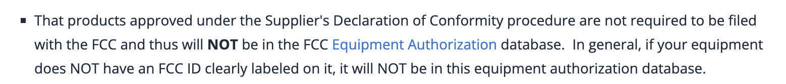
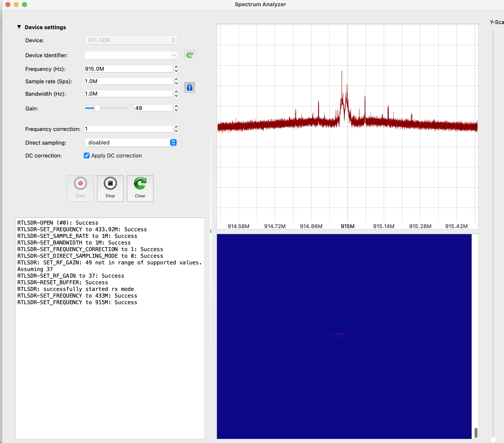
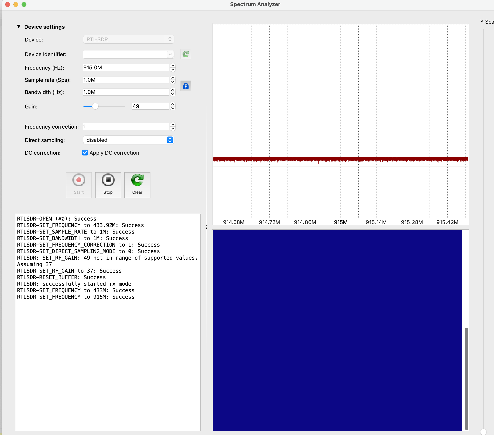
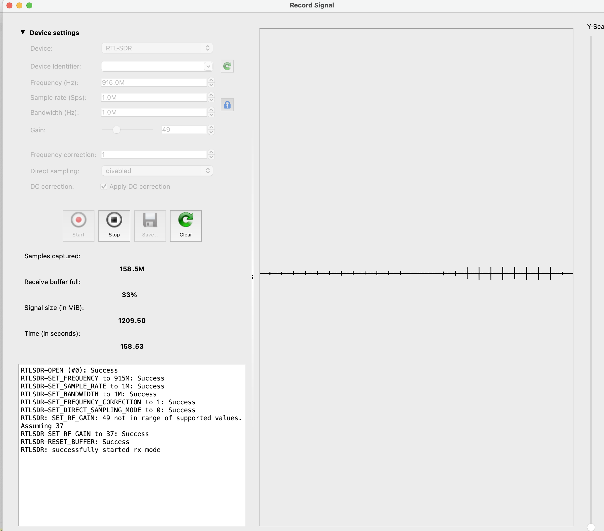
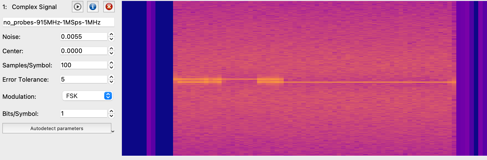

I recently bought a [wireless thermometer](https://www.amazon.com/Wireless-Thermometer-Injector-Upgraded-Grilling/dp/B084L86VTX/ref=asc_df_B084L86VTX/?tag=&linkCode=df0&hvadid=416720912294&hvpos=&hvnetw=g&hvrand=8648917547180588802&hvpone=&hvptwo=&hvqmt=&hvdev=c&hvdvcmdl=&hvlocint=&hvlocphy=9067609&hvtargid=pla-886773437227&ref=&adgrpid=90729935261&th=1) for my grill. The device has a probe hub and a receiver that receives information from the hub wirelessly (up to 500ft). I was wondering if I could hack the device to send wireless signals to my phone. 

There didn't seem to be any schematics or manuals online, so I decided to crack open the device with my [Wowstick](https://www.amazon.com/Wowstick-Electric-Screwdriver-Cordless-Lithium-ion/dp/B07H27G9NF) (yup) to at least get a basic idea of how it worked wirelessly. Maybe the frequency was compatible with normal wi-fi tech in some way? 

Here is a picture:


Board is labeled "BB7-子机_V2.2 FS-06B". 子机 means either "handset" or "slave" (characters mean "son machine" haha). No searches of Google or Baidu pulled up anything useful.

Let's just look at some of these components to get a feel for things, starting with the, >squint< 


## HOLTEK HT1621B

Googling...ok this is the [LCD controller](https://www.holtek.com/productdetail/-/vg/ht1621). There isn't much going on the other side of this PCB (besides the lcd), so for now I'm not going to remove it (the lcd), because I'm not sure it's necessary and I'm afraid of breaking things. 

## ANT1

This is clearly some kind of antenna, but it isn't marked very much. I did a [google image search](https://www.google.com/search?q=wireless+antenna+component+500+ft+coil&tbm=isch&ved=2ahUKEwjz3v7ehMf5AhUbrXIEHVCWAG8Q2-cCegQIABAA&oq=wireless+antenna+component+500+ft+coil&gs_lcp=CgNpbWcQAzoECCMQJ1CfAliXB2DvCGgAcAB4AIABZIgB-gKSAQM1LjGYAQCgAQGqAQtnd3Mtd2l6LWltZ8ABAQ&sclient=img&ei=HUn5YrPcA5vaytMP0KyC-AY&bih=1016&biw=1792) that came up with some pictures close to what I was looking for. 

[This](https://www.adafruit.com/product/4269?gclid=Cj0KCQjwuuKXBhCRARIsAC-gM0he67gxTymu_0_HUhDWDzFzUhCZhhFHXREGbrKEUA4TQSbaQrEvWIkaAqkfEALw_wcB) claims it's "850~950MHz"

There is section of capacitors and inductors nearby, so its probably doing some signal filtering. 


(?? I wonder if I could get data from the DATA chanel? Probably would need some kind of oscilloscope.)

More mysterious are the oscillator and nearby IC. 


The IC is marked "9A1i3". Maybe the oscillator is a clock for the IC, but seems odd because the IC is small and has few pins, making it seem like it would just be a couple logic gates something. 

## Tubular Component Thingy

Using my phone as a microscope, it got the marking to be YXC112GH, which appears to be some kind of resonator made by YXC (probably as a clock, maybe for one of the ICs?). Also, I couldn't find the exact part. 

## Medium size chip

No markings or other labels on the pcb near it

## 

-----------------------

Ok, and nothing else is marked too well or seems that interesting. I'm guessing the other larger chip is some kind of SoC for temperature sensing.

Seems like the 800-900mhz range is not going to be detectable on a phone without special hardware, e.g.: 

https://www.amazon.com/NooElec-NESDR-Mini-Compatible-Packages/dp/B009U7WZCA/ref=psdc_3012292011_t2_B073JWDXMG

But should do a bit more research to make sure. Could also use https://en.wikipedia.org/wiki/LoRa, though seems like too long a range. This is because the antenna was suggested for https://learn.adafruit.com/adafruit-rfm69hcw-and-rfm96-rfm95-rfm98-lora-packet-padio-breakouts/assembly and https://learn.adafruit.com/radio-featherwing

----------------

I reached out to the meat thermometer company's customer support via both email and Facebook. Got this response on Facebook from a nice Chinese woman:

```
You sent
Hi thank you. I wanted to get some information about the communication protocol for your grill thermometer.
I'm working on building an app to track grill temperatures

Viminne
Hi, We are discussing this possibility with our factory engineers
I remember someone asked the same problem few years ago, but at that time there was no way to connect with app, it seems that it was because the transmission protocol did not match, I am now reconfirming with the factory

You sent
Yeah you need an external antenna i think for 900mhz
But I have that
But I'm not sure about the protocol
Thank you so much for your help

Viminne
The wireless frequency is: 915MHz.
I checked my email with that buyer and his plan is to read the transmission with a software-defined radio and store the data in a time-series influxdb database to present to a Grafana web UI. I don't know if that works or not

You sent
Yeah that was my plan too!
I was just wondering if I could get more specifics on the transmission that your device is sending out
For example if there was an encryption or error correction scheme I needed to be aware of

Viminne WM Zhang
ok, I am sending email to asking our factory now, but not sure if they will send us more infos, because they are OEM, Although we have an exclusive sales agreement with him, not sure if they will be willing to provide their technical content

You sent
Ok well thanks for asking. I'm just an open source developer

Viminne WM Zhang
I got this reply: this thermometer uses the wireless 433 transmission protocol, which does not support connecting to a mobile phone
```

------------------

A friend suggested [searching the FCC](https://apps.fcc.gov/oetcf/eas/reports/GranteeSearch.cfm?calledFromFrame=N). Good idea, but nothing came up for the owners of these trademarks: https://uspto.report/TM/88187155, https://trademarks.justia.com/881/87/taimasi-88187155.html. There was a note that some devices don't need to be registered individually, which is usually the case when an FCC ID is not readily visible on the device. I found no FCC ID either on the device shell, on the circuit boards, or in the manual, though it does have an FCC stamp of approval.



-------------

My SDR arrived from Amazon. It claims to only be [compatible with Matlab](https://www.nooelec.com/store/qs), but I wonder if there's a way to make it work with python. I found the [pyrtlsdr](https://pyrtlsdr.readthedocs.io/en/latest/Overview.html#description) lib.

First need to install some dependencies (`brew install librtlsdr`), and Bam, we are in bidness!

=================

While python (or something) will be important later for building my own analysis program, it still feels a bit clunky for doing the signal discovery I want. So I googled around and found the perfect thing: the [Universal Radio Hacker](https://github.com/jopohl/urh). Seems like people use this for hacking everything from RC cars to restaurant waiting pucks. 

https://www.youtube.com/watch?v=QqVvEOzKPCs&list=PLlKjreY6G-1EKKBs9sucMdk8PwzcFuIPB&index=2&ab_channel=Dr.JohannesPohl

I turned on the thermometer and tried scanning 915mz. There seems to be a signal!!



Then when I turn the thermometer off, the signal goes away



So it does seem the 915 was the right frequency, but now I need to figure out what the "433 transmission protocol" is.

For reference, the temperature on the thermometer is 79 degrees (yes I was also replacing my air conditioner today). Also, I've plugged in only probe 3 (there are four temperature probes on the device). 

You can also record signals with URH (universal radio hacker) for analysis. I recorded a baseline signal, then I held the probe in my fist and the temperature increased to 95 degrees (not too clammy). 



Here you can see the baseline signal for 81 degrees, then I turned the probe off for a bit (just to double check that I really wasn't finding some spurious signal), and then holding the thermometer in my hands at 95 degrees. As you can see this changed the amplitude of the signal, so it must be some AM based protocol. 

I next tried using three probes; I put one in my mouth, one in my ear, and one in my...


---------------

One of my most common project execution mistakes is not _always_ doing the following as a _very first step_: 

**Google if someone on the internet has already done the _exact same project_.**

Sure enough, someone did something very very close, and wrote a nice [blog post](https://hackaday.com/2015/04/01/reverse-engineering-a-wireless-bbq-thermometer/) about it. While this is (as usual) slightly disappointing (nothing new under the sun), it's also a relief (no need to muck around cluelessly for too long.) 

A few things to note:

- He used a spectrum analyzer right away to find the device's frequency. Much better than doing open heart surgery on the device as I did. I actually had broken some wires and had to solder them back, which was annoying and risky.

- As far as decoding the protocol, (where I currently am), he built a table of data vs known temperatures. After staring at it long enough, apparently he figured it out.


https://hackaday.io/project/4690-reverse-engineering-the-maverick-et-732/details

It seems this is a fairly common hack. Some basics
https://hackaday.com/2020/01/28/rf-modulation-crash-course-for-hackers/#more-395244

I'm having trouble understanding which Keying method is being used. I think I did not properly center the frequency before, so need to do that. 

Looking at the spectrogram below, it also seems like there is some sort of FM going on.



After a bit more research, it's clear that the device is using frequency shift key. Looking at the spectrum analyzer above, we see two distinct frequency peaks, one for each bit of information.

After a bit of futzing with the frequency cutoff (needed to look at a filtered view to set the threshold), I feel like I'm getting a good signal. 

The signal consists of some non-zero stuff followed by a bunch of zeros. I think the zeros might be blank space for other probes? Or could be an "end of transmission" signal?

Also, the transmissions come in groups of three, then there is a pause. 


Noting that even when there is no signal at all, the transmissions vary every now and then

Ran into a weird issue where the base frequency seemed to be changing for different measurements


